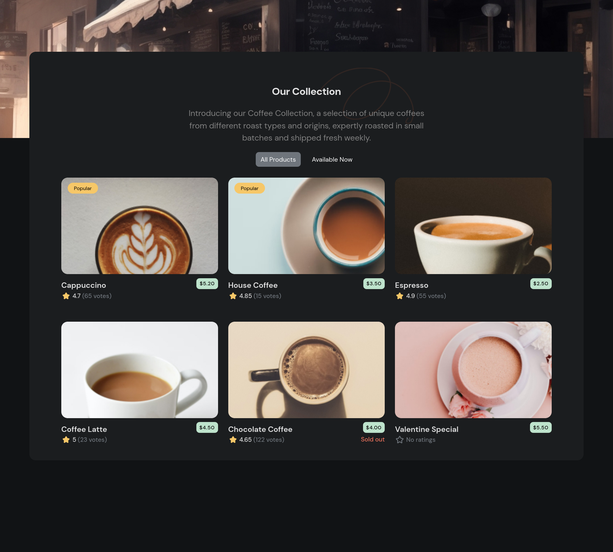

# Simple Coffee Listing project using React

This is a solution to the [Simple coffee listing challange on Devchallanges.io](https://devchallenges.io/challenge/simple-coffee-listing).

## Overview

### The challange
- Create a coffee listing page that matches the given design.
- Use React or other Front-end libraries for this challenge.
- Create a Reusable Card component.
- The card component should include a picture, name, pricing, rating, and number of votes if exists.
- The card component should render popular tag, availability status conditionally.
- Render Coffee list with given data. The data should come from a given API or downloaded JSON file.
- Users can choose to list all products or just available products.

### Screenshot

### Links

- Solution URL: [Github](https://github.com/bhaskrr/react-simple-coffee-listing)
- Live Site URL: [Vercel]()

## Author

- Github - [@bhaskrr](https://github.com/bhaskrr)